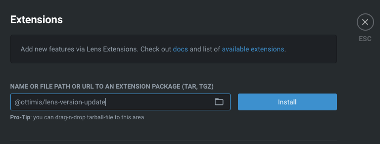

# Lens "Deployment Image Update" Extension

Lens extension to simplify update of deployment image tag (containers & initContainers):

* Just open deployment details and save new image tag.


## Installing

Installation is easy, you just need to follow these steps:

1. Go to the Extensions view (`CMD+SHIFT+E` on macOS).
2. Enter the name of this extension, `@ottimis/lens-version-update`, into the Install Extension box.
3. Click on the Install button.



## Install

```sh
mkdir -p ~/.k8slens/extensions
git clone https://github.com/ottimis/lens-version-update.git
ln -s $(pwd)/lens-version-update ~/.k8slens/extensions/lens-version-update
```

## Build

To build the extension you can run the `npm` commands manually:

```sh
cd lens-version-update
npm install
npm run build
```

If you want to watch for any source code changes and automatically rebuild the extension you can use:

```sh
cd lens-version-update
npm start
```

## Uninstall

```sh
rm ~/.k8slens/extensions/lens-version-update
```

Restart Lens application.
